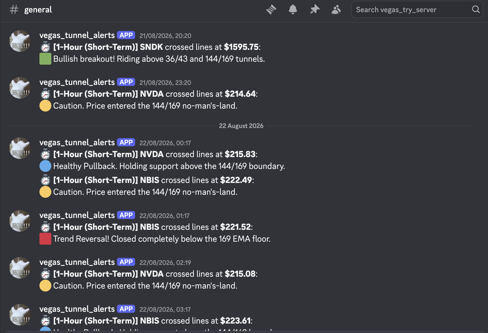

# Vegas Stock Bot 📈 (自動化量化交易推播系統)


這是一個基於 **Vegas 通道 (Vegas Tunnel)** 交易策略的自動化股市掃描機器人。

系統會定期抓取美股科技股的市場數據並進行 EMA 均線分析，當判定符合特定的趨勢反轉或進出場訊號時，會透過 CI/CD 排程，自動將交易訊號即時推播至 Discord 頻道。

## ✨ 核心功能 (Features)

*   **自動化數據抓取**：使用 `yfinance` 即時獲取美股市場的 K 線歷史與最新報價。
*   **Vegas 通道策略實作**：內建自訂的 EMA 均線邏輯（採用 36, 43, 144, 169, 576, 676 週期均線），以演算法判定趨勢反轉與進出場訊號。
*   **無伺服器自動化 (Serverless CI/CD)**：完全依賴 GitHub Actions 的排程功能定時觸發腳本，達到零成本、免伺服器維護的全自動化運作。
*   **Discord 即時推播**：整合 Discord Webhook API，一旦判定符合交易條件，系統會立刻將格式化的訊號推播至指定頻道。

## 📊 監控標的與系統架構 (Watchlist & Architecture)

**目前監控的美股科技與半導體標的包含：**
`MU`, `RKLB`, `NVDA`, `MRVL`, `SNDK`, `NBIS`, `ASX`, `INTC`, `AMKR`, `AMAT`, `GLDM`

**系統資料流架構：**
1. **觸發**：GitHub Actions 依據設定的時間（Cron Job）自動喚醒腳本。
2. **獲取**：Python 腳本透過 API 抓取上述 Watchlist 的最新市場數據。
3. **運算**：使用 Pandas 高效計算 EMA 均線，並執行 Vegas 通道邏輯判斷。
4. **推播**：篩選出符合條件的標的，觸發 Discord Webhook 送出警報。

## 🛠️ 快速啟動 (Quick Start)

如果您想在本地端測試或執行此專案，請依照以下步驟操作：

### 1. 安裝依賴套件
請確保您的系統已安裝 Python 3.8 或以上版本。接著，在終端機執行以下指令安裝所需的套件：

```bash
pip install yfinance pandas requests
```

### 2. 設定 Discord Webhook 
本系統依賴 Discord 頻道進行訊息推播。請在執行前設定環境變數，填入您專屬的 Webhook 網址：

```bash
# Linux / macOS 系統
export DISCORD_WEBHOOK_URL="請在此貼上您的_Discord_Webhook_網址"

# Windows 系統 (Command Prompt)
set DISCORD_WEBHOOK_URL="請在此貼上您的_Discord_Webhook_網址"
```
*(註：若僅為本地快速測試，您也可以直接在程式碼中配置該網址)*

### 3. 執行主程式
環境設定完成後，即可執行腳本進行市場掃描與訊號推播：

```bash
python vegas_scanner_anywhere.py
```

## ⚙️ GitHub Actions 自動化部署 (CI/CD)

本專案已設定好完整的 CI/CD 流程。如果您想要 Fork 此專案並讓它在雲端全自動 24 小時運作，請依照以下步驟設定：

### 1. Fork 專案與啟用 Actions
1. 點擊右上角的 **Fork** 將專案複製到您的帳號下。
2. 進入您的專案頁面，點擊上方的 **Actions** 標籤頁。
3. 點擊 **"I understand my workflows, go ahead and enable them"** 來允許自動化腳本執行。

### 2. 設定 Secret (環境變數)
因為 Discord Webhook 網址屬於機密資訊，不可直接寫在程式碼中，請透過 GitHub Secrets 進行設定：
1. 點選專案上方的 **Settings** 頁籤。
2. 在左側選單找到 **Secrets and variables**，並點擊下拉選單中的 **Actions**。
3. 點擊綠色按鈕 **New repository secret**。
4. **Name** 填寫：`DISCORD_WEBHOOK_URL`
5. **Secret** 填寫：您的 Discord 頻道 Webhook 網址。
6. 點擊 **Add secret** 儲存。

### 3. 排程運作說明
設定完成後，GitHub Actions 將會依照 `.github/workflows` 目錄下的 YAML 檔案設定，定時自動觸發 `vegas_scanner_anywhere.py` 進行市場掃描與訊號推播。您無需維持電腦開機或維護任何伺服器。


